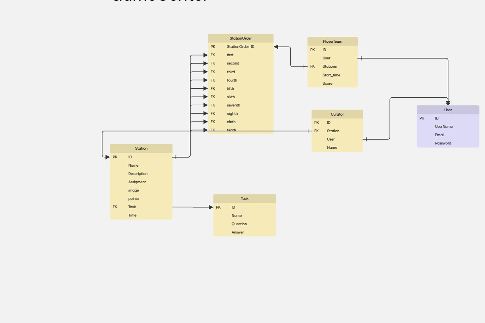

## запуск в  локалке
```bash
cd/GameCenter-FastAPI 
uv run app/main.py
проставить в файле ./app/db.py  в "genarate_schemas" значение True
```

## запуск в Docker
1. перейти в папку
```bash
cd /GameCenter-FastAPI 
```
2. запустить docker-compose.yml
```bash
docker compose up -d 
```
3. запустить миграции
```bash
docker-compose exec web uv run aerich upgrade
```
4. создать суперпользователя
```bash 
docker-compose exec web uv run app/create_superuser.py
```
5. создать 10 станций
```bash
docker-compose exec web uv run app/create_stations.py
```
6. создать 10 заданий 
```bash
docker-compose exec web uv run app/create_tasks.py
```
7. создать 10 кураторов  
```bash
docker-compose exec web uv run app/create_curators.py
```
8. cоздать 10 капитанов 
```bash
docker-compose exec web uv run app/create_player_teams.py
```

9. 
```bash
docker-compose exec web uv run app/drop_tables.py
```
# В ПРОЦЕССЕ РАЗРАБОТКИ 
 - bash-скрипт накатать один чтоб эти команды не прописывать для вноса данных В БД
 - api-tests
 - СI/CD in github action
 - деплой на https://gamecenter.ru 

## Документация и Админка

- Документация http://localhost:8000/docs
- Админка http://localhost:8000/admin

## Диаграмма Базы данных


